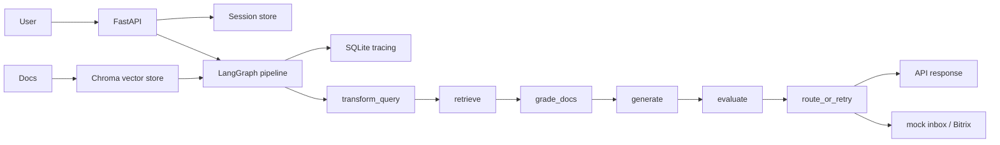

# RAG Support Assistant

RAG Support Assistant отвечает на вопросы поддержки по внутренней базе знаний, используя локальную LLM через Ollama, Chroma для retrieval и LangGraph для orchestration. Если уверенного ответа нет, запрос маршрутизируется на человека через mock inbox или Bitrix. API и UI работают через FastAPI, а ключевые шаги пайплайна пишутся в SQLite tracing.

## Architecture



## Quick Start

### Requirements

- Python 3.11+
- Ollama installed locally
- Git and `pip`

### Setup

```bash
python -m venv .venv
source .venv/bin/activate
pip install -r requirements.txt
cp .env.example .env
ollama pull mistral
ollama serve
uvicorn main:app --host 0.0.0.0 --port 8000 --reload
```

PowerShell activation: `.venv\Scripts\Activate.ps1`

## Environment Variables

Use `.env.example` as the source of truth.

| Variable | Description | Default |
| --- | --- | --- |
| `OLLAMA_BASE_URL` | URL of local Ollama API | `http://localhost:11434` |
| `OLLAMA_MODEL_NAME` | Generation model name | `mistral` |
| `RAG_EMBEDDING_MODEL` | Embedding model | `BAAI/bge-m3` |
| `RAG_RERANKER_MODEL` | Cross-encoder reranker | `cross-encoder/ms-marco-MiniLM-L-6-v2` |
| `RAG_HYBRID_SEARCH` | Enable BM25 + vector hybrid search | `true` |
| `RAG_RETRIEVAL_TOP_K` | Candidates before reranking | `20` |
| `RAG_RERANK_TOP_K` | Final documents after reranking | `5` |
| `RAG_SEMANTIC_CHUNKING` | Enable semantic chunking | `false` |
| `RAG_SELF_RAG_MAX_ITER` | Max retry iterations in Self-RAG | `2` |
| `RAG_SELF_RAG_MIN_QUALITY` | Minimum quality before escalation/retry | `70` |
| `RAG_VECTOR_BACKEND` | Vector backend | `chroma` |
| `SUPPORT_SINK_BACKEND` | Escalation sink backend | `local` |
| `BITRIX_WEBHOOK_URL` | Bitrix webhook for escalations | empty |
| `REQUIRE_OLLAMA` | Fail fast if Ollama is unavailable | `false` |
| `SESSION_TTL_SECONDS` | Inactive API session TTL | `7200` |

## API

| Method | Path | Description |
| --- | --- | --- |
| `POST` | `/api/ask` | Ask a question with optional `session_id` |
| `POST` | `/api/upload` | Upload and index a document |
| `GET` | `/api/sessions/{session_id}/history` | Get conversation history |
| `DELETE` | `/api/sessions/{session_id}` | Clear one session |
| `GET` | `/api/health` | Probe Ollama, Chroma and SQLite health |

## Tests

```bash
pytest tests/ -v
```

## Docker

```bash
docker compose up
```

The container exposes port `8000` and starts `uvicorn main:app`.
