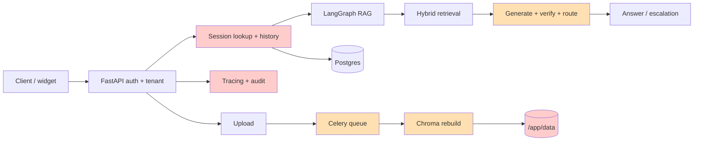

# Глубокий аудит RAG Support Assistant

**Дата:** 23 июля 2026
**Репозиторий:** `D:\RAG_Support_Assistant`
**Проверенный commit:** `383cfe90e8a5b75e831e8ad5b5fea792b15f7c9f` (`master`, синхронизирован с `origin/master`)
**Тип аудита:** архитектура, RAG-качество, multi-tenancy, безопасность, надёжность, ingestion, эксплуатация, CI/CD и тестовая стратегия.

> ## 2026-08-03 revalidation + local remediation (active)
>
> **Статус аудита: ACTIVE.** Detailed findings below remain the **2026-07-23
> audit snapshot** @ `383cfe9` — historical defect evidence, not rewritten as
> if the defects never existed. This top layer records later revalidation and
> local remediation against HEAD `74d187c`. Project/production release is
> **not** complete.
>
> **Решение владельца (HF):** Hugging Face **не** является publication target
> и **не** required user-runtime dependency для рекомендуемого external-user
> path. Hosted HF Space не существует и не планируется. External users run
> locally with their own `MISTRAL_API_KEY`, remote Mistral embeddings, and
> empty `RAG_RERANKER_MODEL`. Owner local-first / GraceKelly defaults
> unchanged. README/QUICKSTART already document that recipe. Do not duplicate
> or modify recipes.
>
> ### Remediation evidence note (local, not full production DoD)
>
> | Slice | Commits | Local verification | Still open (external / live) |
> |---|---|---|---|
> | Policy/docs reopen + no-HF path | `edb729c` | Docs recipe preserved | N/A (policy) |
> | TEN-01 / TEN-02 | `3c1e7b7`, `28580aa` | Test-first red (7+7); 41 tenant/audit + 49 adjacent; schema/migration 39; Ruff/mypy clean; `alembic heads` = `018` | Real PostgreSQL upgrade/downgrade; live two-tenant restart drill |
> | OPS-01 chart + backup runtime | `ed8520a`, `2767b9d` | Helm red→green (23 fail / 7 pass → 30 pass); backup runtime red→green (11 fail / 10 pass → aggregate 52 pass / 1 skip); Ruff/mypy; helm lint + default/existing/dev-disabled renders; production data-disabled fails closed | Docker image build/tool smoke; live Postgres; kind/live install; app pod recreation; clean-namespace restore to **disposable** DB; known-query smoke; measured RPO/RTO |
> | OBS-01 trace identity | `5a9f857` | Test-first red (8 expected failures on `fbf3bcf`) → green; QA positional-only legacy callable (`TypeError` → fixed); independent regression 44 passed / 1 deprecation warning; Ruff clean; mypy `--follow-imports=skip` clean; `git diff --check` clean | N/A for OBS-01 local contract. Plan step 5 still open for timeout cancellation, bounded capacity, session concurrency/history ordering, sticky experiment propagation. No production release claim |
> | ING-01 step 4.1 durable job contract | `b7faa19` | Initial contract failed at collection on missing `IngestionJob`, then green; review QA 12 expected failures → fixed; log QA 6 expected failures → fixed; final independent focused 47 passed / 2 deprecation warnings; adjacent independent chunks 22 + 19 passed; original 11-file quiet aggregate exceeded 3 minutes without failure (not raw-retried; splitting showed no hang/failure); Ruff/mypy clean; Alembic `019 (head)`; `git diff --check` clean; protected user artifacts 9/9 unchanged | Step-4 remainder after 4.4 (below) |
> | ING-01 step 4.2 worker topology | `4f93038` | Initial worker contracts 18 expected failures / 2 passes → 21 green; adversarial grace QA 4 expected failures at 120s → corrected to 3600; strengthened focused 24 passes; independent Codex topology/Helm/Compose 47 passes (+ pre-existing README wording-contract failure fixed in docs pass); adjacent ingestion task + async upload 10 passes; durable job 27 passes / 2 warnings; docs suite 21 passes / 1 warning; Ruff/mypy clean; Helm lint clean; `docker compose config --quiet` clean; `git diff --check` clean; protected artifacts 9/9 unchanged | Step-4 remainder after 4.4 (below) |
> | ING-01 step 4.3 durable liveness/recovery | `6dc6fe4` | Independent Codex after final Grok changes: 55 liveness + 9 ingest-task + 12 upload/security + 26 settings + 27 durable job-contract + 24 docs = **153 passed**; expected deprecation warnings only; Ruff clean; mypy `--follow-imports=skip` clean; `alembic heads` = `020 (head)`; `git diff --check` clean; protected artifacts 9/9 unchanged. Test-first/adversarial: import-order fixture leak fixed via late session resolution; runtime clamp/fallback tests red before correction; explicit blank env 25 expected failures → 25/25 green | Queue-age metric/alert; live Redis/Postgres/Celery worker-outage/recovery drill; real PostgreSQL upgrade/downgrade through migrations `019`/`020`/`021`. ING-02 and TEN-03 remain open |
> | ING-01 step 4.4 bounded upload retry/idempotency | `1cebd14` | Tenant-scoped hashed `Idempotency-Key`; payload fingerprint conflict detection; partial unique migration `021`; deterministic task identity reserved before publish; queued-only source readiness; bounded off-loop Celery broker-publish retry; 503 replay header + CORS/docs. Independent Codex: 73 focused tests / 2 expected warnings; Ruff clean; locked core/API mypy clean; `alembic heads` = `021 (head)`; diff checks clean | Queue-age metric/alert; post-mutation task autoretry intentionally disabled while ING-02 is open; live outage/recovery and real migration drills; ING-02 and TEN-03 remain open |
> | ING-01 step 4.5 queue-age observability | `35e4bb9` | Label-free oldest-queued async age gauge refreshed by the independent reaper; `source_ready_at` with legacy `created_at` fallback; empty queue resets to 0; warning fires after `>300s` for `5m` before default 900-second terminal timeout. Test-first 3 red → 7 green; closure gate 87 passed / 1 expected warning; Ruff and locked strict Mypy clean; diff checks clean | Live Redis/Postgres/Celery worker-outage/recovery drill; real PostgreSQL migration drills; ING-02 and TEN-03 remain open |
> | TEN-03 step 4.6 collision-resistant physical naming | `d13804b` | Lowercase-safe tenant IDs remain stable; uppercase, Windows-reserved, lossy, or truncated IDs receive a deterministic 16-hex SHA-256 suffix across Chroma document/fact-card collections and uploads. Explicit reindex/fact-card cache paths share the mapping; ambiguous hashed `reindex --all` discovery fails closed. Test-first 3 failures / 6 passes → 18 passes; batched QA 3 failures / 9 passes → 21 passes; final adjacent gate 109 passed / 2 expected warnings; Ruff, locked strict Mypy, and diff checks clean | Per-tenant distributed locking; ING-02 atomic/versioned publish + rollback; live drills |
> | ING-02 step 4.7 per-tenant rebuild lock | `705a3cc` | Canonical-tenant PostgreSQL session advisory lock serializes document/fact-card mutation across API, Celery, and CLI; distinct tenants remain independent; bounded timeout and coordination/ownership failures fail closed. Test-first 7 failures → 7 passes; single QA follow-up 59 passed; final worker/job/upload/docs gate 105 passed / 2 expected warnings; Ruff, locked strict Mypy, and diff checks clean | Versioned staging, validation, atomic active-version switch, rollback; live PostgreSQL contention drill |
> | ING-02 step 4.8a active-version manifest | `c015ba8`, `ca15c1a` | Strict-schema per-tenant v1 registry beside Chroma; legacy fallback only when absent; corrupt/partial state fails closed; same-directory flush + `fsync` + `os.replace`; active→previous and monotonic generation; current tenant-lock token required. Test-first 7 failures → 7 passes; QA float-schema assertion red→green; final manifest/naming/lock gate 27 passed / 2 expected warnings; Ruff, locked strict Mypy, and diff checks clean | Registry is not wired into rebuild/retrieval; versioned staging/validation, runtime switch + cache invalidation, rollback/retention/fault injection, and live drills remain open |
> | ING-02 step 4.8b validated staging collection | `74d187c` | Unwired lock-token-gated builder uses version names outside the legacy namespace, builds without deleting active, persists when supported, validates exact count + raw-vector dimension, and cleans only its unpublished candidate on failure. Test-first 6 failures → 6 passes; QA 2 failures → 2 passes; final staging/manifest/naming/lock gate 33 passed / 2 expected warnings; Ruff, locked strict Mypy, and diff checks clean | Not wired into upload/reindex/retrieval; known-query validation, manifest switch + generation-aware cache invalidation, rollback/retention/fault injection, and live drills remain open |
>
> **P0 release-blocker implementation is locally remediated and mechanically
> verified; OBS-01 is locally remediated at `5a9f857`; ING-01 is further
> partially locally remediated at `35e4bb9` (durable job/status + Compose/Helm
> worker topology/health/readiness + durable lease/heartbeat + stale
> recovery/reaper + bounded broker-publish retry/idempotency + queue-age
> observability); TEN-03 is locally remediated at `d13804b`; ING-02 race
> protection and its unwired manifest/staging contracts are partially locally
> remediated at `74d187c`.** Production release
> remains gated by the live/external
> checks above. Plan step 4 is **in progress**, not complete. Do **not** treat
> the whole audit plan, OPS-01 operational DoD, or project closure as complete.
>
> ### Status matrix @ `74d187c`
>
> | ID | Priority | Status | Evidence @ HEAD |
> |---|---|---|---|
> | TEN-01 | P0 | **local remediated; live DoD open** | `/api/ask` validates UUIDs; Session/history/write scoped by tenant; fails closed on caller UUID during DB outage; does not rebind `default`. `Message.tenant_id` required; composite `(session_id, tenant_id) → sessions(id, tenant_id)` via migration `018`. Live two-tenant restart + real Postgres migration drill not run on this host |
> | OPS-01 | P0 | **local chart/runtime verified; operational restore DoD open** | Chart defaults create/attach data (10Gi), backups (20Gi), reports (5Gi); `existingClaim`/class/accessModes/size supported; production mounts `/app/data` and fails if data persistence disabled; readiness checks mounted R/W + HTTP; storage-dependent jobs conditional; backup-snapshot mounts `/app/data` RO; Secret `DATABASE_URL` → runtime `POSTGRES_URL`; image installs `postgresql-client` + `age`, non-root `USER app`. Live image/cluster/restore/RPO/RTO gates still open |
> | TEN-02 | P0 | **local remediated; live DoD open** | `log_audit` requires/persists `tenant_id`; all call sites updated; fallback logs redacted. Live multi-tenant audit drill still open with TEN-01 |
> | REL-01 | P1 | **open** | `asyncio.wait_for` + `to_thread` still cancel wait only; post-audit work added timeout *observability* (`ad50b0d`, `3ff0bc3`) but not cooperative cancellation / capacity hold |
> | RAG-01 | P1 | **open** | Streaming path in `api/routers/conversation.py` remains a separate RAG; parity still dual-work |
> | RAG-02 | P1 | **open** | Route still quality/relevance-centric; factuality / knowledge_gap not auto-route gates |
> | ESC-01 | P1 | **open** | `route="human"` still metric/badge without mandatory durable ticket |
> | ING-01 | P1 | **partially locally remediated** @ `35e4bb9` | **4.1** durable job: ORM `IngestionJob` + migration `019`; `/api/upload` returns durable `job_id` + real tenant; `/api/jobs/{job_id}` and `/api/tasks/{identifier}` read DB only; worker verifies identity, propagates tenant, records DB lifecycle; sync paths fail closed on unpersistable transitions; Celery progress best-effort only; phase-level error redaction. **4.2** topology: Compose one `worker` (same build/env/DB/Redis/data as app; no ports; concurrency 1; `ingest@%h`; exact-node health; 3600s warm shutdown); Helm enabled-by-default Celery sidecar in one-replica app pod (RWO co-located); shares image/envFrom/data/security/resources/checksum; exact worker readiness/liveness + 3600s grace; fails closed if persistence off / `replicaCount != 1` / concurrency != 1; `tasks.worker_health` pings only `ingest@socket.gethostname()`, validates pong, fail-closed on malformed/broker errors. **4.3** liveness/recovery: migration `020`; persisted opaque worker lease token with heartbeat/expiry; atomic queued→running claim; tenant/token/status CAS for heartbeat and terminal transitions; background interruptible heartbeat; independent FastAPI stale queued/expired-lease/legacy-running reaper (only async jobs reaped); recovery clears active ownership/stale result while preserving last heartbeat; sync SQL reaper off event loop; shutdown cancels+awaits reaper; runtime liveness config fails closed (blank explicit env; heartbeat ≥ lease). **4.4** retry/idempotency: migration `021`; tenant-scoped hashed idempotency key + payload fingerprint conflict; deterministic task identity before publish; queued-only source readiness; bounded off-loop broker-publish retry; 503 replay identity; no post-mutation worker autoretry. **4.5** queue age: label-free oldest queued async age gauge + pre-timeout Prometheus warning. **Still open:** live Redis/Postgres/Celery worker-outage/recovery drill; real PostgreSQL upgrade/downgrade through migrations `019`/`020`/`021`. Original finding prose below is the 2026-07-23 audit snapshot |
> | ING-02 | P1 | **partially locally remediated** @ `74d187c` | PostgreSQL canonical-tenant advisory lock serializes document/fact-card mutation across API, Celery, and CLI. Strict per-tenant manifest and validated versioned-staging builders exist as unwired contracts; candidates do not delete or switch active and failure cleanup targets only the candidate. Runtime rebuild still uses delete-then-build; upload/reindex integration, known-query validation, manifest switch/cache invalidation, rollback/retention/fault injection, and live drills remain open |
> | TEN-03 | P1 | **locally remediated** @ `d13804b` | Shared deterministic physical naming preserves lowercase-safe IDs and hash-suffixes uppercase, Windows-reserved, lossy, or truncated canonical IDs across Chroma, uploads, reindex, and fact-card cache paths; ambiguous hashed `reindex --all` discovery fails closed. Legacy ambiguous directory ownership still requires explicit operator verification/move or re-ingest |
> | OBS-01 | P1 | **locally remediated** @ `5a9f857` | `traces.trace_id` is always a fresh internal UUID4; external `X-Request-Id` stored in nullable indexed `traces.correlation_id` (may repeat); old SQLite schemas migrate append-only (historic rows NULL); legacy `start_trace(trace_id=...)` accepted as correlation alias only; graph state / `AskResponse.trace_id` use internal UUID; response `X-Request-Id` header remains external correlation. No idempotency/replay behavior added. Original finding prose below is the 2026-07-23 audit snapshot |
> | EVAL-01 | P1 | **open** | Mock regression executor still can synthesize expected answers |
> | WID-01 | P1 | **open** | Widget embed/auth/session contract unchanged |
> | SEC-01 | P1 | **open** | OIDC linking still lacks hard `email_verified` gate |
> | API-01 | P2 | **open** | Body limit still Content-Length based |
> | CACHE-01 | P2 | **open** | In-memory Redis fallback still unbounded / no reconnect |
> | SEC-02 | P2 | **open** | Production placeholder/dev-admin gaps remain |
> | DEP-01 | P2 | **open** | Docs-site dependency posture not re-audited this pass |
> | MAINT-01 | P2 | **open** | Large orchestration modules still dual contracts |
>
> **Latest implementation slice:** plan step **4.8b** validated staging
> collection contract is locally complete at `74d187c`. Do **not** claim runtime
> atomic/versioned publish, rollback, or live/external drills complete. Step 4
> is **in progress** (4.1–4.8b done at `b7faa19` / `4f93038` / `6dc6fe4` /
> `1cebd14` / `35e4bb9` / `d13804b` / `705a3cc` / `c015ba8` / `ca15c1a` /
> `74d187c`). No next slice was started; remaining open P1/P2 findings keep
> their prior status without new evidence.
>
> Active plan: [`plan_sol_23_07_26`](plan_sol_23_07_26).

## Итоговый вердикт

Проект заметно выше уровня прототипа: есть LangGraph-пайплайн, hybrid retrieval, tenant-aware коллекции, реальные offline-оценки, трассировка, миграции, Helm, hashed dependency locks и сильный CI. Однако **в текущем виде проект нельзя считать готовым к multi-tenant production**.

Причина не в количестве функций или проценте coverage, а в трёх нарушенных инвариантах:

1. tenant должен ограничивать каждое чтение и запись данных;
2. один пользовательский запрос должен порождать один канонический ответ и одну ограниченную вычислительную работу;
3. успешный CI-gate должен проверять реальное поведение, а не синтетический ответ, построенный из ожидаемых слов.

Обнаружены три release-blocker уровня P0:

- основной `/api/ask` может загрузить историю сессии другого tenant по известному `session_id`;
- Helm deployment хранит uploads, Chroma и SQLite traces в эфемерной файловой системе, а backup CronJob ссылаются на PVC, которых chart не создаёт;
- audit-записи не получают фактический `tenant_id` при записи и попадают в `default`.

**Диагностическая оценка:** 6,1/10. Это сильная инженерная база с хорошей шириной функциональности, но пока с недостаточно жёсткими границами данных и runtime-контрактами.

| Область | Оценка | Краткий вывод |
|---|---:|---|
| Функциональность и продуктовый охват | 8/10 | Богатый support/RAG-продукт, несколько каналов и agent workflow |
| RAG-качество | 6/10 | Высокий recall, но средняя precision и fail-open routing |
| Multi-tenancy и безопасность данных | 4/10 | Есть системные tenant-механизмы, но основной ask-path и audit нарушают границу |
| Надёжность и управление ресурсами | 5/10 | Есть timeout/semaphore, но работа продолжает выполняться после timeout |
| Ingestion и жизненный цикл данных | 4/10 | Неатомарный rebuild, отсутствующий worker, production storage не подключён |
| Тесты и CI | 7/10 | Большой suite и хорошие базовые gates, но критические контракты замоканы или не проверяются |
| Поддерживаемость | 6/10 | Хорошая модульная база, но несколько сверхкрупных orchestration-функций |
| Документация и эксплуатационные материалы | 8/10 | Документация подробная и местами честно фиксирует ограничения |

## База и методика

Фактический размер отличается от ощущения «небольшого RAG-сервиса»:

- 793 tracked-файла;
- 322 Python-файла и около 54,3 тыс. строк Python;
- 158 Python test-файлов и около 21,4 тыс. строк тестов;
- 862 явных `test_*`-функции; durable state фиксирует 919 collected tests с параметризацией;
- крупные orchestration-модули: `agent/graph.py` — более 2,3 тыс. строк, `api/app.py` — более 1,6 тыс., `api/routers/conversation.py` — около 1 тыс.;
- `ask_stream` содержит около 579 строк и более 100 ветвлений с учётом вложенных функций.

Аудит включал:

- трассировку данных от HTTP auth/tenant до Session, Message, AuditLog, Chroma и trace storage;
- сопоставление sync и streaming RAG-путей;
- проверку fail-open/fail-closed поведения grader, fact verification и route;
- анализ upload → Celery → rebuild → Chroma;
- render Helm chart и проверку ссылок на storage;
- чтение CI workflow и regression executor;
- анализ актуального 100-case RAG A/B-отчёта;
- локальные lint/security/tests и чтение последнего GitHub Actions run.

### Выполненные проверки

| Проверка | Результат |
|---|---|
| `ruff check .` | PASS |
| Bandit medium/high | PASS, 0 medium/high; 53 low advisory |
| `helm lint --strict` | PASS |
| Helm render | PASS синтаксически; выявлены ссылки на отсутствующие `*-backups` и `*-reports` PVC, `/app/data` не смонтирован |
| Целевые pytest-наборы | 68 passed: tenant, timeout, request ID, streaming parity, ingestion, Helm, body limits, regression runner |
| Последний CI run на HEAD | PASS, run `29800014844`, 21 июля 2026 |
| `npm audit` для `docs-site` | 8 advisory: 6 high, 1 moderate, 1 low; fixes available |
| `pip-audit` локально | Не завершился за 3 минуты из-за сетевого ожидания; процесс остановлен. CI security на HEAD прошёл с документированными upstream-исключениями |

Один агрегированный pytest-запуск из 13 файлов не завершился за 4 минуты; после разбиения на четыре независимых набора те же приоритетные области дали 68/68 PASS. Это не трактуется как test failure. Полный suite и тяжёлый live RAG-eval повторно не запускались на Windows из-за ресурсных ограничений; использован свежий CI и checked-in live-report.

## Что уже сделано хорошо

1. **Инженерные gates.** CI проверяет Python 3.11/3.13, unit/integration, coverage, mypy strict-scope, Ruff, migrations, Helm, Bandit и hashed lock через pip-audit.
2. **Хорошая база observability.** Есть request ID, Prometheus, SQLite traces, OpenTelemetry и online evaluator infrastructure.
3. **Не декоративная RAG-оценка.** В репозитории есть свежий live A/B на 100 aircargo-кейсах, а не только mock unit tests.
4. **Tenant awareness уже пронизывает проект.** Tenant есть в JWT, Session, audit schema, vector collection naming, admin filters и большинстве router-path. Поэтому исправление границы возможно хирургически, без полного переписывания.
5. **Хорошая конфигурационная дисциплина.** Значительная часть tuning вынесена в `Settings`, секреты отделены от ConfigMap, dependency locks содержат hashes.
6. **Документация фиксирует реальные ограничения.** Например, backup runbook прямо сообщает, что chart пока не создаёт PVC для `/app/data`.
7. **Docker app работает не от root и использует один worker осознанно.** Это снижает часть риска до внешнего переноса session-state.

Эти сильные стороны важно сохранить. Основная проблема проекта — не отсутствие инструментов, а неполнота проверяемых контрактов между ними.

## Карта критических потоков

Красные узлы нарушают обязательные tenant/durability-инварианты. Оранжевые узлы формально работают, но дают ложный product/runtime-контракт.

## Реестр находок

| ID | Приоритет | Находка | Основной эффект |
|---|---|---|---|
| TEN-01 | P0 | `/api/ask` читает Session и Message без tenant-фильтра | Межtenant-доступ к истории и смешивание сообщений |
| OPS-01 | P0 | Helm app не монтирует `/app/data`; chart не создаёт используемые PVC | Потеря uploads/Chroma/traces и неработающие backup jobs |
| TEN-02 | P0 | `log_audit()` не принимает/не записывает tenant | Audit leakage в `default`, отсутствие журнала у реального tenant |
| REL-01 | P1 | Timeout не останавливает thread/graph, semaphore освобождается | Неограниченная «фоновая» нагрузка, двойные ответы/мутации |
| RAG-01 | P1 | Streaming — отдельный упрощённый RAG; parity запускает второй ответ | Разные ответы/metadata/history, двойная стоимость |
| RAG-02 | P1 | Auto-route игнорирует factuality и `knowledge_gap` | Непроверенный ответ может уйти автоматически |
| ESC-01 | P1 | `route="human"` не создаёт durable ticket | Метрика/бейдж есть, оператор задачу не получает |
| ING-01 | P1 | Default upload ставится в Celery, но compose/Helm не запускают worker | Accepted-задачи остаются необработанными |
| ING-02 | P1 | Chroma rebuild удаляет активную коллекцию до успешной сборки | Потеря индекса при ошибке и гонки upload/reindex |
| TEN-03 | P1 | Lossy tenant sanitization создаёт коллизии namespace | Разные tenant могут разделить Chroma/upload namespace |
| OBS-01 | P1 | Клиентский request ID используется как PK trace | Повтор request ID вызывает collision и срыв pipeline |
| EVAL-01 | P1 | Regression CI строит mock-ответ из ожидаемых слов | Gate не способен обнаружить RAG-регрессию |
| WID-01 | P1 | Widget блокируется X-Frame-Options, не имеет auth/session contract | Публичный embed-сценарий фактически неработоспособен |
| SEC-01 | P1 | OIDC связывает аккаунт по email без явной проверки `email_verified` | Риск ошибочного account linking |
| API-01 | P2 | Body limit доверяет только `Content-Length` | Chunked/отсутствующий header обходят лимит |
| CACHE-01 | P2 | In-memory fallback без TTL/limit и без reconnect | Stale cache, рост памяти, multi-replica divergence |
| SEC-02 | P2 | Production принимает placeholder `DB_ENCRYPTION_KEY` и dev-admin bypass | Слабая защита encrypted columns / опасный misconfiguration |
| DEP-01 | P2 | Docs CI допускает текущие high advisory | Supply-chain debt и устаревшее обоснование gate |
| MAINT-01 | P2 | Сверхкрупные orchestration-функции дублируют контракты | Высокая цена изменений и тестовые blind spots |

## P0 — release-blockers

### TEN-01. Основной ask-path нарушает tenant-изоляцию сессий

**Доказательство.** В [`api/app.py:934`](api/app.py#L934):

- пользовательский `session_id` нормализуется как UUID, но не отклоняется при ошибке;
- Session выбирается только по `DBSession.id` ([`api/app.py:964`](api/app.py#L964));
- Message выбираются только по `Message.session_id` ([`api/app.py:979`](api/app.py#L979));
- tenant существующей `default`-сессии может быть переписан tenant текущего пользователя ([`api/app.py:972`](api/app.py#L972));
- полученная DB history загружается в новую in-memory `ConversationSession` ([`api/app.py:1022`](api/app.py#L1022)).

После restart или cache miss аутентифицированному пользователю достаточно передать известный UUID чужой сессии: история будет прочитана до проверки tenant. Сообщения последующего запроса также записываются только через `session_id`.

Есть второй дефект в том же потоке: невалидный UUID проходит `except: pass`, затем падает внутри DB-блока и устанавливает глобальный `_db_retry_after` на 60 секунд. Один аутентифицированный клиент может повторять это и отключать DB lookup/persistence для всех сессий процесса. В session-history router уже существует правильный образец `_try_parse_uuid`; основной ask-path ему не следует.

**Почему существующие тесты зелёные.** `tests/test_tenant_isolation_sessions.py` проверяет `/api/sessions*`, а большинство ask-тестов заменяют `_get_or_create_session`. Реальная цепочка auth tenant → DB Session → Message → in-memory history не выполняется.

**Исправление корневой причины:**

1. Валидировать UUID на schema boundary и возвращать 422/400 до DB circuit logic.
2. Искать Session по `(id, tenant_id)`; при несовпадении возвращать непрозрачный 404 и никогда не «перепривязывать» `default`.
3. Читать Message только через tenant-scoped Session join либо добавить `tenant_id` и composite FK/constraint.
4. Не использовать один глобальный cooldown для client-validation и инфраструктурных DB-ошибок.
5. Добавить Postgres RLS или эквивалентную DB-level защиту как второй слой.

**Обязательный regression test:** два tenant, одна БД, одинаковый/чужой session UUID, очищенный in-memory cache и настоящий `/api/ask`; проверить отсутствие чтения, записи и tenant mutation.

### OPS-01. Production storage в Helm эфемерен, backup jobs ссылаются на отсутствующие PVC

В [`deploy/helm/templates/deployment.yaml:1`](deploy/helm/templates/deployment.yaml#L1) у app-контейнера нет `volumeMounts` и pod `volumes`. Следовательно, `data/uploads`, Chroma и `data/tracing/traces.db` живут в writable layer pod и теряются при пересоздании.

Одновременно:

- backup/restore/staleness CronJob ссылаются на `<release>-backups` и `<release>-reports`;
- chart не содержит ни одного `PersistentVolumeClaim`;
- Helm lint, render и client dry-run остаются зелёными, потому что Kubernetes допускает ссылку на ещё не существующий claim;
- [`docs/operations/backup-restore.md:23`](docs/operations/backup-restore.md#L23) уже честно описывает этот разрыв.

Это не «улучшение на будущее», а production data-loss blocker: Postgres не является источником для rebuild; `scripts/reindex.py` требует сохранённые uploads.

**Исправление корневой причины:**

- определить authoritative storage: object storage для original uploads + versioned metadata в Postgres; Chroma — rebuildable artifact;
- до миграции минимум создать/подключить PVC для `/app/data`, backups и reports;
- сделать CronJob условными и требовать `existingClaim` либо создавать claim;
- добавить restore drill в отдельном namespace и проверку, что rebuilt index отвечает на known queries;
- readiness не должна быть зелёной, если mandatory storage read/write probe не проходит.

**DoD:** удалить app pod, восстановить новый, получить прежний документ и trace; затем восстановить из backup в чистое окружение в пределах заявленных RPO/RTO.

### TEN-02. AuditLog всегда записывается как tenant `default`

Модель содержит tenant-column с `server_default="default"` ([`db/models.py:169`](db/models.py#L169)), а read/purge-path фильтрует по нему. Но [`db/audit.py:14`](db/audit.py#L14) не принимает `tenant_id`, и конструктор `AuditLog` его не заполняет.

В результате:

- администратор non-default tenant не видит собственные audit events;
- администратор `default` потенциально видит actor/resource/IP/detail других tenant;
- tenant, передаваемый внутри encrypted `detail`, не участвует в изоляции;
- при DB failure fallback пишет detail и IP обычным текстом в application log.

**Исправление:**

- сделать `tenant_id` обязательным аргументом `log_audit`, без default;
- передавать его из auth context во всех call sites;
- добавить invariant test, запрещающий вызов без tenant;
- tenant-scoped insert/read/delete проверить на настоящей БД;
- fallback отправлять в структурированный защищённый sink с redaction, а не в обычный INFO-log.

## P1 — существенные риски надёжности и качества

### REL-01. Timeout возвращает ответ, но вычисление продолжает жить

`/api/ask` запускает `session.ask` через `asyncio.to_thread` и оборачивает в `wait_for` ([`api/routers/conversation.py:205`](api/routers/conversation.py#L205)). При timeout отменяется ожидание, но Python thread не останавливается. `finally` сразу освобождает semaphore ([`api/routers/conversation.py:350`](api/routers/conversation.py#L350)).

Внутри `ConversationSession` может существовать ещё один `ThreadPoolExecutor(max_workers=1)`; комментарий прямо подтверждает, что graph «not cancellable» и продолжает выполнение после budget timeout ([`agent/graph.py:2568`](agent/graph.py#L2568)).

Следствия:

- после серии 504 фактическое число работающих pipeline превышает `MAX_CONCURRENT_PIPELINES`;
- продолжаются provider calls, retrieval, traces, tool actions и mutation history;
- клиент может повторить запрос и получить две параллельные работы;
- один session не защищён от параллельного изменения `_history` и `_pending_action`.

**Решение:** один bounded executor/job queue, cooperative deadline на каждом provider/retriever/tool boundary, capacity release только после реального завершения job. На ближайшем этапе — per-session lock и единый request deadline; в целевой архитектуре — durable request job с состояниями `queued/running/cancel_requested/completed/failed`.

### RAG-01. Streaming генерирует другой ответ, чем основной graph

[`api/routers/conversation.py:435`](api/routers/conversation.py#L435) реализует самостоятельный retriever → prompt → streaming LLM путь. Он обходит query transformation, document grading, Self-RAG retry, fact verification и tool flow.

При `STREAMING_RAG_PARITY=true` параллельно запускается полноценный `session.ask` ([`api/routers/conversation.py:503`](api/routers/conversation.py#L503)). Пользователь видит streamed answer, но quality/route/citations берутся из второго ответа. При этом graph может записать в in-memory history свой ответ, а БД — streamed answer. Это не parity, а две независимые транзакции.

Дополнительно token deadline проверяется только после получения очередного token. Если async generator не выдаёт token, deadline не срабатывает. Некоторые post-processing вызовы и fallback также выполняются без полного bounded contract.

**Решение:** LangGraph должен стать единственным execution path и публиковать token/node events. Sync endpoint собирает эти события в один ответ, SSE передаёт их клиенту. Один trace, одна generation, одна history mutation, один набор citations.

### RAG-02. Routing декларирует factuality, но не использует её

`make_route_or_retry_node` принимает решение только по `quality_score` и `relevance_score` ([`agent/graph.py:1658`](agent/graph.py#L1658)). При этом `relevance_score` — просто `quality_score / 100`, то есть два gate фактически являются одним ([`agent/graph.py:1567`](agent/graph.py#L1567)).

`factuality_score` и `knowledge_gap` вычисляются, но не входят в auto-route. Более того, fact verification присваивает 100, когда:

- нет ответа или контекста;
- verification отключён;
- ответ короткий;
- extractor вернул `NONE`;
- claims не удалось распарсить.

См. [`agent/graph.py:1327`](agent/graph.py#L1327) и [`agent/graph.py:1487`](agent/graph.py#L1487). Если grader отверг все документы, downstream использует `graded_docs or context_docs`, возвращая исходные документы. Ошибка grader также fail-open сохраняет документ.

**Решение:**

- заменить score-only модель на состояния `verified / unsupported / not_verified`;
- auto-route разрешать только при наличии context, поддержанных citations, factuality выше calibrated threshold, `knowledge_gap=false` и отсутствии node errors;
- `not_verified` никогда не считать 100;
- all-docs-rejected направлять на controlled rewrite либо human, но не возвращать исходный context;
- разделить answer quality, retrieval relevance, grounding и policy safety на независимые сигналы.

### ESC-01. Human route — это метрика, а не handoff

Низкое качество заканчивается `route="human"`, но endpoint лишь увеличивает `ESCALATION_TOTAL` ([`api/routers/conversation.py:412`](api/routers/conversation.py#L412)). UI показывает badge; durable `EscalatedTicket` создаётся только в отдельном exception-path или после ручного `/api/escalate`.

В проекте существуют как минимум три механизма эскалации: DB ticket, `_escalate_to_inbox` и ручной endpoint. У них разные гарантии и статусы.

**Решение:** единый idempotent escalation service + transactional outbox. Любой terminal human/error route должен вернуть `ticket_id` и состояние доставки. Нельзя сообщать «передано оператору», пока durable ticket не создан.

### ING-01. Upload сообщает accepted, хотя worker отсутствует

Для tenant `default` upload вызывает `ingest_document.delay()` и сразу возвращает `accepted` ([`api/routers/upload.py:121`](api/routers/upload.py#L121)). В `docker-compose.yml` есть Redis, поэтому enqueue обычно успешен, но Celery worker отсутствует. В Helm worker Deployment также отсутствует.

Итог: самый документированный локальный stack способен бесконечно хранить `PENDING`-задачи. Non-default tenant при этом использует другой, синхронный путь.

**Решение:** либо сделать worker полноценной обязательной частью topology с heartbeat/readiness/queue-age alerts, либо убрать Celery contract. API должен возвращать durable `job_id`, а status endpoint — фактический state и ошибку. Одинаковая модель job должна применяться ко всем tenant.

### ING-02. Rebuild индекса неатомарен

`build_vector_store` открывает текущую Chroma collection, вызывает `delete_collection()`, затем `from_documents()` ([`vectordb/manager.py:204`](vectordb/manager.py#L204)). При падении embeddings/Chroma после delete рабочий индекс уже потерян. Одновременные uploads/reindex для одного tenant не сериализованы.

**Решение:** per-tenant distributed lock, versioned staging collection, validation (count, embedding dimension, known-query smoke), atomic pointer/alias switch, сохранение предыдущей версии и idempotent job keys. Original uploads должны быть immutable/versioned.

### TEN-03. Tenant namespace может коллидировать

`a/b` и `a?b` после `_sanitize_tenant` становятся одинаковыми; длинные tenant ID с одинаковым префиксом обрезаются до одного collection name ([`vectordb/manager.py:47`](vectordb/manager.py#L47)). Upload directory использует аналогичную lossy-замену ([`api/routers/upload.py:63`](api/routers/upload.py#L63)).

**Решение:** единая строгая tenant schema на этапе issuance/configuration и collision-resistant physical name: безопасный slug + hash canonical tenant ID либо mapping table с unique constraint.

### OBS-01. Correlation ID ошибочно используется как уникальный trace ID

Клиент вправе повторить `X-Request-Id`, например при retry. Router передаёт его как `trace_id`, а `start_trace` выполняет обычный `INSERT` в PK `traces.trace_id` ([`tracing/_base_trace.py:289`](tracing/_base_trace.py#L289)). Повтор вызывает collision до запуска graph.

**Решение:** генерировать внутренний уникальный trace UUID всегда, а внешний correlation ID хранить отдельным indexed attribute. Если нужна idempotency — это отдельный ключ с явно заданным response-replay contract.

### EVAL-01. Regression gate синтетически гарантирует успех

CI запускает eval только при изменении четырёх путей и не включает graph, retrieval, ingestion, providers или streaming ([`.github/workflows/ci.yml:309`](.github/workflows/ci.yml#L309)). Обычно baseline и candidate оба равны `current`.

Главнее другое: `--mock-experiment-runtime` строит ответ из `expected.answer_contains`, создаёт требуемые citations и выставляет quality не ниже 75 ([`scripts/regression_eval.py:156`](scripts/regression_eval.py#L156)). Такой executor не может обнаружить ухудшение retrieval или generation.

Dataset содержит 35 русских single-turn cases только tenant `default`; нет reference answers, multi-turn, citations grounding, tools, streaming, adversarial tenant cases. `min_quality` записан как `0.3–0.5`, тогда как runtime использует шкалу `0–100`, поэтому quality-condition практически бессодержателен.

**Решение:** быстрый PR-gate должен запускать настоящий graph на deterministic local corpus/provider stub, который не знает expected output. Baseline — artifact от merge-base, candidate — текущий SHA. Scheduled gate запускает live providers/judge. Dataset должен иметь schema validation и slices.

### WID-01. Embeddable widget нарушает собственный контракт

- глобальный `X-Frame-Options: DENY` блокирует `/static/widget.html` во frame ([`api/app.py:1643`](api/app.py#L1643));
- CSP не задаёт разрешённый `frame-ancestors`;
- widget вызывает `/api/ask` без Bearer/API key/cookie bootstrap ([`static/widget.inline.js:110`](static/widget.inline.js#L110));
- production auth в таком случае возвращает 401/503;
- widget не сохраняет и не отправляет возвращённый `session_id`;
- child принимает init-message и меняет `apiBase` без строгой allowlist/source handshake.

**Решение:** отдельный widget bootstrap endpoint, короткоживущий audience-scoped token, явный `WIDGET_ALLOWED_ORIGINS`, path-specific CSP `frame-ancestors`, сохранение session ID и cross-origin Playwright E2E.

### SEC-01. OIDC account linking требует усиления

`resolve_oidc_user` проверяет наличие `sub` и `email`, но не требует `email_verified`; затем может связать существующего локального пользователя по `username == email` с новым provider/subject ([`auth/oidc.py:108`](auth/oidc.py#L108)).

Отдельно OIDC tenant resolver не поддерживает wildcard `*`, хотя email-channel resolver поддерживает, а README рекомендует `*:default`. Это создаёт различное поведение одного config key.

**Решение:** требовать verified email для linking, хранить identity как `(issuer, subject)`, не перепривязывать существующую identity без отдельного подтверждения, объединить tenant resolver и его wildcard semantics.

## P2 — hardening и поддерживаемость

### API-01. Body limit обходится без Content-Length

Middleware проверяет только header и не считает фактически полученные ASGI chunks ([`api/app.py:1785`](api/app.py#L1785)). Тесты отправляют обычный TestClient request с `Content-Length` и не покрывают chunked/отсутствующий header.

Нужен receive-wrapper, который прекращает чтение после лимита, плюс proxy-level limit. Upload следует стримить во временный файл вместо накопления `bytearray` до 50 MiB на каждый concurrent request; добавить parser quotas для zip/PDF bombs.

### CACHE-01. Redis fallback не ограничен и не восстанавливается

После первой startup-ошибки `_use_fallback=True` навсегда отключает reconnect. Fallback — обычный dict без TTL/size bound, хотя API обещает TTL ([`cache/redis_cache.py:15`](cache/redis_cache.py#L15)).

Ключ LLM cache содержит только tenant и hash вопроса; в нём нет версии model/prompt/index. После deploy или смены модели старый ответ может жить до TTL.

Нужны reconnect with backoff, bounded TTL cache и cache namespace из `tenant + index_version + prompt_version + model_id + normalized_query`.

### SEC-02. Production secret validation неполна

Production проверяет только непустой `DB_ENCRYPTION_KEY`, а `.env.example` содержит известный placeholder `changeme-generate-with-secrets-token_urlsafe`. Для session secret также нет minimum length. `ALLOW_DEV_ADMIN_LOGIN=1` разрешает production без admin hash ([`config/settings.py:942`](config/settings.py#L942)).

Следует запрещать известные placeholders, требовать длину/энтропию, исключить dev-admin bypass из production и добавить key version/rotation procedure для encrypted columns.

### DEP-01. Docs dependency gate устарел

Локальный `npm audit` 23 июля 2026 показал 8 advisory, включая 6 high. Установлены `astro@6.3.0`, `sharp@0.34.5`, `vite@7.3.3`, `js-yaml@4.1.1`, `svgo@4.0.1`, `dompurify@3.4.5`.

Workflow допускает всё ниже critical и утверждает, что non-breaking fixes нет. Это уже неверно: npm сообщает fixes available. Среди официальных advisory:

- [Astro reflected XSS, patched in 6.3.3](https://github.com/advisories/GHSA-8hv8-536x-4wqp);
- [Astro SSRF, patched in 6.4.6](https://github.com/advisories/GHSA-2pvr-wf23-7pc7);
- [sharp/libvips vulnerabilities](https://github.com/advisories/GHSA-f88m-g3jw-g9cj);
- [Vite Windows path bypass](https://github.com/advisories/GHSA-fx2h-pf6j-xcff).

Статическая Pages-сборка снижает reachability части Astro SSR advisory, а dev-server findings не равны production exploit. Тем не менее lock следует обновить и gate должен требовать явное, датированное reachability-исключение для каждого high, а не общий `|| true`.

### MAINT-01. Дублирование orchestration уже создаёт дефекты

Главная проблема крупных модулей — не длина сама по себе. В `ask`, `ask_stream`, fallback, graph budget, upload sync и upload Celery повторяются lifecycle, timeout, persistence и error contracts. Поэтому исправление одного пути не исправляет соседний.

После P0/P1 behavioral tests следует выделить:

- `SessionService` — tenant-safe load/append/lock;
- `PipelineRunner` — deadline, capacity, sync/SSE events;
- `EscalationService` — durable ticket/outbox;
- `IngestionJobService` — enqueue/status/atomic index publish;
- `TraceService` — internal trace ID + external correlation ID.

Рефакторинг до фикса контрактов опасен: он переместит дефекты, но не докажет их устранение.

## Оценка фактического RAG-качества

Свежий live A/B report [`reports/ragas/20260718T173221Z-8c2fd13e-q1-context-precision-ab.json`](reports/ragas/20260718T173221Z-8c2fd13e-q1-context-precision-ab.json) даёт полезную честную базу:

| Метрика production arm | Значение |
|---|---:|
| Context precision | 0,5768 |
| Context recall | 0,98 |
| FULL / PART / MISS | 97 / 2 / 1 |
| Faithfulness | 0,8406 |
| Answer relevancy | 0,89 |

Это означает:

- retriever почти всегда находит нужный материал;
- в контекст попадает много лишнего;
- генерация в среднем сильная, но около 16% faithfulness gap ещё существенны для auto-support;
- простое уменьшение `k` повышает precision, но ухудшает FULL/MISS; все семь alternative arms получили `no-ship`.

Поэтому следующий качественный рывок — не очередное слепое изменение `top_k`. Приоритет:

1. честный grounding gate и fail-closed route;
2. hard-negative/near-duplicate training set для reranker;
3. query/entity-aware candidate generation;
4. contextual compression с сохранением citation spans;
5. slice-based thresholds для разных типов запросов;
6. проверка на нескольких tenant/domains, а не только aircargo.

Реалистичная цель следующей итерации:

| Метрика | Текущая | Цель без деградации safety |
|---|---:|---:|
| Context precision | 0,5768 | ≥ 0,63 |
| Context recall | 0,98 | ≥ 0,97 |
| FULL / MISS | 97 / 1 | ≥ 97 / ≤ 1 |
| Faithfulness | 0,8406 | ≥ 0,90 |
| Answer relevancy | 0,89 | ≥ 0,92 |
| Auto answers без verified grounding | Не измеряется | 0 |

Цели должны быть подтверждены минимум тремя повторными runs и confidence intervals, иначе разница может быть шумом конкретного judge/run.

## Почему зелёный CI не опровергает находки

Последний CI на HEAD действительно зелёный: [GitHub Actions run 29800014844](https://github.com/brownjuly2003-code/RAG_Support_Assistant/actions/runs/29800014844). Это положительный сигнал, но границы gates важнее цвета:

- tenant ask-flow в тестах замокан;
- Helm проверяет валидный YAML/API schema, но не существование referenced PVC;
- timeout tests проверяют HTTP-ответ, а не прекращение underlying work;
- streaming parity tests проверяют текущую двойную реализацию, а не единственность answer;
- ingestion tests подменяют worker/index;
- regression-eval на этом run был skipped по path filter;
- когда запускается mock regression, expected data используется для создания «правильного» ответа;
- coverage gate 72% измеряет исполнение строк, но не tenant/durability invariants; durable state фиксирует около 73,3%.

Следовательно, проекту нужен не просто больший coverage, а **contract coverage** критических границ.

## Рекомендуемая тестовая пирамида

1. **Security invariants:** настоящая Postgres-схема, два tenant, все Session/Message/Audit/Trace endpoints, cache cold/warm.
2. **Runtime lifecycle:** controllable provider, который блокируется; тест доказывает, что после timeout работа остановлена либо capacity остаётся занятой до завершения.
3. **Canonical answer contract:** один provider invocation, одинаковые answer/route/citations/history для sync и SSE.
4. **Ingestion transaction:** fault injection на каждом шаге build; старая collection остаётся доступной до atomic switch.
5. **Deployment semantics:** rendered manifest invariant «каждый claimName либо создаётся chart, либо объявлен existingClaim»; app storage write/restart/read smoke.
6. **Widget E2E:** реальный cross-origin parent + iframe + token bootstrap + multi-turn session.
7. **RAG regression:** deterministic corpus без доступа executor к expected fields; отдельный scheduled live judge.
8. **Adversarial slices:** prompt injection in documents, wrong-tenant IDs, malformed UUID, repeated request ID, chunked body, concurrent same-session confirm.

## Рекомендуемый порядок действий

1. Немедленно закрыть TEN-01, OPS-01 и TEN-02; до этого не выпускать multi-tenant production.
2. Затем устранить REL-01 и RAG-01: единый bounded pipeline и единый answer path.
3. Исправить RAG-02 и ESC-01, чтобы `auto` и `human` означали реальное проверяемое действие.
4. Перевести ingestion на durable job + atomic versioned index.
5. Заменить mock regression gate и расширить datasets.
6. После закрепления контрактов декомпозировать orchestration-модули.

Подробный исполнимый план с моделью и reasoning для каждого шага записан отдельно в `plan_sol_23_07_26`.

## Что не стоит делать первым

- Не начинать с массового split `agent/graph.py` и `conversation.py`: без contract tests дефекты просто разъедутся по новым файлам.
- Не повышать coverage ради процента; добавить сначала тесты на указанные инварианты.
- Не включать `STREAMING_RAG_PARITY=true` как «быстрый фикс»: это удвоит вычисления и сохранит два разных ответа.
- Не снижать `top_k` глобально: текущий A/B уже показывает потерю recall/FULL.
- Не считать `route="human"` успешной эскалацией без durable `ticket_id`.
- Не считать `helm lint` доказательством готовности storage/backup.

## Границы аудита

- Эксплуатационная БД и production secrets не читались и не изменялись.
- Exploit-вызовы против реальных tenant-данных не выполнялись; дефекты подтверждены трассировкой code/data flow.
- Paid/live provider evaluation не запускался; использован checked-in live-report от 18 июля 2026.
- Полный pytest не повторялся локально; источник полного состояния — зелёный CI на проверенном HEAD.
- Python advisory service локально завис; текущая Python dependency posture подтверждена только CI от 21 июля и lock/config, а не повторным live `pip-audit`.
- Девять существовавших untracked-файлов не изменялись и не включались в аудит как доверенный код.

## Вывод

У проекта уже есть большинство компонентов зрелой RAG-платформы. Существенный прирост качества даст не добавление новых features, а восстановление строгих инвариантов: tenant-scoped data access, один канонический pipeline, durable ingestion/escalation/storage и честный regression gate. После закрытия этих пунктов существующая CI/evaluation-инфраструктура станет сильным активом; до этого она создаёт избыточное ощущение готовности.
