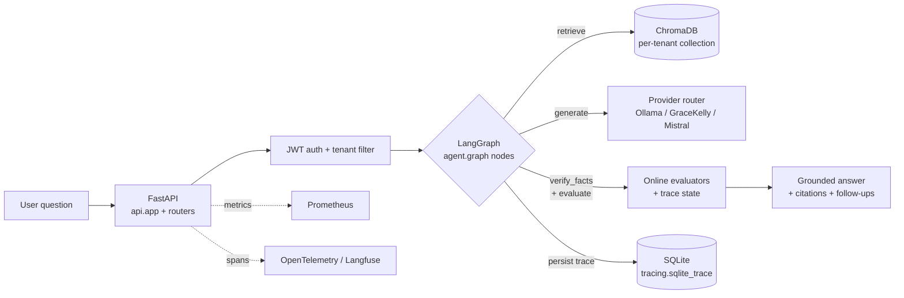

import { Aside } from '@astrojs/starlight/components';

## Request lifecycle

A single user question travels through this path before a grounded answer
is returned. The diagram covers the synchronous `/api/ask` path; ingest and
admin paths share the same surface but skip the LangGraph stage.

The path is one-way; the LangGraph node loop (retry, rewrite_query) lives
inside the `Graph` box and is detailed in
[LangGraph state machine](/RAG_Support_Assistant/architecture/langgraph/).
Each node, store, and provider maps to a directory below.

## Top-level modules

  <article class="q-card">
    <h3 class="q-title">
      api/
    </h3>
    

Thin FastAPI app shell + routers split per concern (auth, sessions, agent, admin, analytics, feedback, conversation, upload). Late-binding through <code>api._shared.app_module()</code> keeps <code>monkeypatch.setattr(api.app, ...)</code> tests working.

  </article>

  <article class="q-card">
    <h3 class="q-title">
      agent/
    </h3>
    

LangGraph state machine: <code>state.py</code> (TypedDict shape), <code>graph.py</code> (nodes + edges), <code>prompts.py</code>, <code>prompt_registry.py</code> (experiment-aware sticky-rollout), <code>tools.py</code>. See the auto-generated <a href="/RAG_Support_Assistant/architecture/langgraph/">LangGraph state machine</a>.

  </article>

  <article class="q-card">
    <h3 class="q-title">
      llm/providers/
    </h3>
    

Pluggable provider abstraction: <code>base.py</code> interface, <code>ollama.py</code>, <code>gracekelly.py</code> (browser-proxy to Perplexity Pro), <code>mistral.py</code> (OpenAI-compatible). Failover to local via routing profiles. See the <a href="/RAG_Support_Assistant/architecture/providers/">provider routing matrix</a>.

  </article>

  <article class="q-card">
    <h3 class="q-title">
      vectordb/
    </h3>
    

Hybrid retriever (BM25 + dense + cross-encoder rerank). Tenant-aware <code>vectordb.manager</code> wraps the base ChromaDB engine in <code>_base_manager.py</code>; each tenant lands in a separate collection.

  </article>

  <article class="q-card">
    <h3 class="q-title">
      evaluation/
    </h3>
    

Online + offline evaluators, RAGAS-style metrics without the ragas package, regression runner with mock-by-default paid-API gate, experiment registry, rollback watcher, weekly improvement backlog, threshold recommendations.

  </article>

  <article class="q-card">
    <h3 class="q-title">
      tracing/
    </h3>
    

<code>tracing._base_trace</code> is the canonical SQLite store; <code>tracing.sqlite_trace</code> is the public API that wraps it and adds PII redaction on <code>log_step</code> (production code imports from <code>tracing.sqlite_trace</code>). Langfuse and OpenTelemetry adapters export the same span data when configured.

  </article>

## Data stores

| Store | Purpose | Notes |
| --- | --- | --- |
| **ChromaDB** | Vector store for KB chunks. | Per-tenant collection. Persistent on disk. |
| **SQLite** | Canonical LangGraph trace store (`tracing.sqlite_trace` over `tracing._base_trace`). | WAL mode; runtime store, not a dev-only fallback. |
| **Postgres** | Sessions, feedback, escalated tickets, experiments. | Alembic migrations 001–017. Round-trip CI gate. Tracing does not go here. |
| **Redis** | Rate-limit counters, JWT refresh sessions, ephemeral cache. | Optional in dev (in-memory fallback). |

## Cross-cutting concerns

- **Multi-tenancy** is enforced at four layers: schema (tenant_id columns),
  propagation (`api/middleware/tenant.py`), query enforcement (per-router
  filters), and per-tenant ChromaDB collections.
- **Resilience** — provider calls are wrapped in a configurable chain of
  timeout, retry, circuit-breaker, semaphore, and wall-time budget layers;
  the exact composition lives in `llm/providers/runtime.py`.
- **Observability** ships 24+ Prometheus metrics, alert rules in
  `deploy/helm/`, and OpenTelemetry → Langfuse generation tracing.
- **Security** stays fail-fast on missing JWT/SESSION/admin secrets at startup
  when `RAG_ENV=production`. Tenant isolation is tested cross-tenant for every
  surface.

<Aside type="note" title="See also">
  - [Module layout & deprecations](/RAG_Support_Assistant/guides/deprecations/) — historical shim
    cleanup phases and the current canonical import map.
  - [Quickstart](/RAG_Support_Assistant/guides/quickstart/) — boot the stack end-to-end locally.
</Aside>
