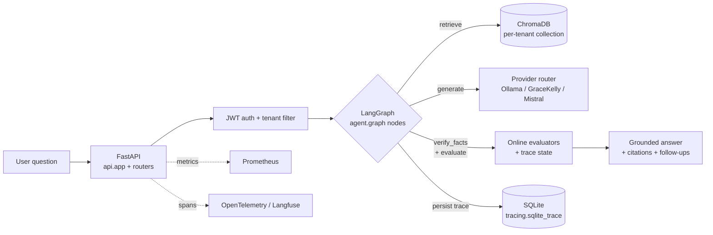

import { Aside, Card, CardGrid } from '@astrojs/starlight/components';

## Request lifecycle

A single user question travels through this path before a grounded answer
is returned. The diagram covers the synchronous `/api/ask` path; ingest and
admin paths share the same surface but skip the LangGraph stage.

The path is one-way; the LangGraph node loop (retry, rewrite_query) lives
inside the `Graph` box and is detailed in
[LangGraph state machine](/RAG_Support_Assistant/architecture/langgraph/).
Each node, store, and provider maps to a directory below.

## Top-level modules

<CardGrid>
  <Card title="api/" icon="rocket">
    Thin FastAPI app shell + routers split per concern (auth, sessions, agent,
    admin, analytics, feedback, conversation, upload). Late-binding through
    `api._shared.app_module()` keeps `monkeypatch.setattr(api.app, ...)` tests
    working.
  </Card>
  <Card title="agent/" icon="puzzle">
    LangGraph state machine: `state.py` (TypedDict shape), `graph.py` (nodes
    + edges), `prompts.py`, `prompt_registry.py` (experiment-aware
    sticky-rollout), `tools.py`. See the auto-generated
    [LangGraph state machine](/RAG_Support_Assistant/architecture/langgraph/).
  </Card>
  <Card title="llm/providers/" icon="random">
    Pluggable provider abstraction: `base.py` interface, `ollama.py`,
    `gracekelly.py` (browser-proxy to Perplexity Pro), `mistral.py`
    (OpenAI-compatible). Failover to local via routing profiles. See the
    [provider routing matrix](/RAG_Support_Assistant/architecture/providers/).
  </Card>
  <Card title="vectordb/" icon="seti:db">
    Hybrid retriever (BM25 + dense + cross-encoder rerank). Tenant-aware
    `vectordb.manager` wraps the base ChromaDB engine in `_base_manager.py`;
    each tenant gets an isolated collection.
  </Card>
  <Card title="evaluation/" icon="approve-check">
    Online + offline evaluators, RAGAS, regression runner with mock-by-default
    paid-API gate, experiment registry, rollback watcher, weekly improvement
    backlog, threshold recommendations.
  </Card>
  <Card title="tracing/" icon="setting">
    `tracing._base_trace` is the canonical SQLite store; `tracing.sqlite_trace`
    is the public API that wraps it and adds PII redaction on `log_step`
    (production code imports from `tracing.sqlite_trace`). Langfuse and
    OpenTelemetry adapters export the same span data when configured.
  </Card>
</CardGrid>

## Data stores

| Store | Purpose | Notes |
| --- | --- | --- |
| **ChromaDB** | Vector store for KB chunks. | Per-tenant collection. Persistent on disk. |
| **SQLite** | Canonical LangGraph trace store (`tracing.sqlite_trace` over `tracing._base_trace`). | WAL mode; runtime store, not a dev-only fallback. |
| **Postgres** | Sessions, feedback, escalated tickets, experiments. | Alembic migrations 001–017. Round-trip CI gate. Tracing does not go here. |
| **Redis** | Rate-limit counters, JWT refresh sessions, ephemeral cache. | Optional in dev (in-memory fallback). |

## Cross-cutting concerns

- **Multi-tenancy** is enforced at four layers: schema (tenant_id columns),
  propagation (`api/middleware/tenant.py`), query enforcement (per-router
  filters), and per-tenant ChromaDB collections.
- **Resilience** wraps the Ollama path with timeout → retry → circuit breaker →
  pipeline semaphore → wall-time budget; identical chain applied to GraceKelly
  and Mistral.
- **Observability** ships 24+ Prometheus metrics, alert rules in
  `deploy/helm/`, and OpenTelemetry → Langfuse generation tracing.
- **Security** stays fail-fast on missing JWT/SESSION/admin secrets at startup
  when `RAG_ENV=production`. Tenant isolation is tested cross-tenant for every
  surface.

<Aside type="note" title="See also">
  - [Module layout & deprecations](/RAG_Support_Assistant/guides/deprecations/) — historical shim
    cleanup phases and the current canonical import map.
  - [Quickstart](/RAG_Support_Assistant/guides/quickstart/) — boot the stack end-to-end locally.
</Aside>
