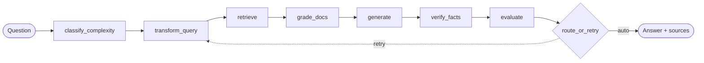

## Proof points

<div class="q-cardgrid q-cardgrid--accent">
  <article class="q-card">
    <h3 class="q-title">
      <span class="q-label">Published docs hub</span>
    </h3>
    <div class="q-body"><p>Docs are published under <code>/RAG_Support_Assistant</code>. English and Russian entry pages are maintained explicitly.</p></div>
  </article>

  <article class="q-card">
    <h3 class="q-title">
      <span class="q-label">Seeded support KB</span>
    </h3>
    <div class="q-body"><p>The demo KB starts from three seed documents: warranty, returns, and E10-E30 errors. E20 is present in <code>errors_e10_e30.md</code>.</p></div>
  </article>

  <article class="q-card">
    <h3 class="q-title">
      <span class="q-label">Fixture-backed evaluation</span>
    </h3>
    <div class="q-body"><p>The fixture set has 12 cases across error codes, password reset, warranty, installation, billing, and general support. The three-document demo KB does not cover every fixture category.</p></div>
  </article>

  <article class="q-card">
    <h3 class="q-title">
      <span class="q-label">Traceable integration surface</span>
    </h3>
    <div class="q-body"><p>The API catalog is tied to FastAPI route decorators, and <code>/api/ask</code> returns an answer with documents and citations.</p></div>
  </article>
</div>

### One question's path through LangGraph



The full flowchart, with all 12 nodes and conditional transitions, is generated
automatically from `agent/graph.py` on the
[LangGraph state machine](/RAG_Support_Assistant/architecture/langgraph/) page.

### What `/api/ask` returns for "How do I fix E20?"

```json
{
  "answer": "Error E20 is a water-drainage problem. Likely causes: a clogged drain filter, a kinked drain hose, or a faulty drain pump [1].",
  "sources": [
    { "source": "errors_e10_e30.md", "page_content": "E20 — water drainage problem …" }
  ],
  "citations": [
    { "index": 1, "doc_id": "errors_e10_e30.md", "title": "errors_e10_e30.md", "excerpt": "drain valve / filter …" }
  ]
}
```

The shape is fixed by the Pydantic models `AskResponse`, `SourceInfo`, and
`Citation` in `api/routers/conversation.py`. For the full node-by-node
walkthrough, see [What it does](/RAG_Support_Assistant/examples/).

## Start here

<div class="q-next">

- [What it does](/RAG_Support_Assistant/examples/) walks one E20 question through the graph.
- [Reproduce E20](/RAG_Support_Assistant/reproduce-e20/) gives the deterministic trust path: seed, ingest, ask, verify.
- [Try locally](/RAG_Support_Assistant/guides/quickstart/) covers the local setup path.
- [Evaluation](/RAG_Support_Assistant/evaluation/) covers what is measured, how, and where the limits are.
- [GitHub](https://github.com/brownjuly2003-code/RAG_Support_Assistant) contains the source.

</div>
