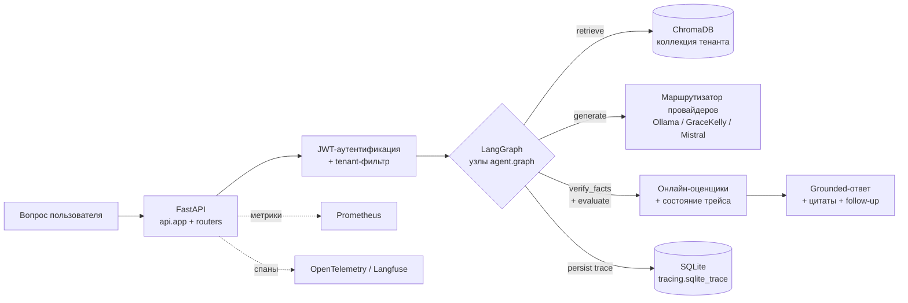

import { Aside } from '@astrojs/starlight/components';

## Жизненный цикл запроса

Один пользовательский вопрос проходит этот путь до того, как вернётся
grounded-ответ. Диаграмма покрывает синхронный путь `/api/ask`; пути
ingest и admin используют ту же поверхность, но пропускают стадию
LangGraph.

Путь одностoронний; узловой цикл LangGraph (retry, rewrite_query) живёт
внутри блока `Graph` и подробно описан на странице
[Конечный автомат LangGraph](/RAG_Support_Assistant/ru/architecture/langgraph/).
Каждый узел, хранилище и провайдер мапится на каталог ниже.

## Модули верхнего уровня

  <article class="q-card">
    <h3 class="q-title">
      api/
    </h3>
    

Тонкая оболочка FastAPI + роутеры по функциональным областям (auth, sessions, agent, admin, analytics, feedback, conversation, upload). Позднее связывание через <code>api._shared.app_module()</code> сохраняет работоспособность тестов с <code>monkeypatch.setattr(api.app, ...)</code>.

  </article>

  <article class="q-card">
    <h3 class="q-title">
      agent/
    </h3>
    

Конечный автомат LangGraph: <code>state.py</code> (форма TypedDict), <code>graph.py</code> (узлы + рёбра), <code>prompts.py</code>, <code>prompt_registry.py</code> (sticky-rollout с поддержкой экспериментов), <code>tools.py</code>. См. автогенерируемую страницу <a href="/RAG_Support_Assistant/ru/architecture/langgraph/">Конечный автомат LangGraph</a>.

  </article>

  <article class="q-card">
    <h3 class="q-title">
      llm/providers/
    </h3>
    

Подключаемая абстракция провайдеров: интерфейс <code>base.py</code>, <code>ollama.py</code>, <code>gracekelly.py</code> (browser-прокси к Perplexity Pro), <code>mistral.py</code> (OpenAI-совместимый). Failover к локали через профили маршрутизации. См. <a href="/RAG_Support_Assistant/ru/architecture/providers/">матрицу маршрутизации провайдеров</a>.

  </article>

  <article class="q-card">
    <h3 class="q-title">
      vectordb/
    </h3>
    

Гибридный ретривер (BM25 + dense + cross-encoder rerank). Tenant-aware <code>vectordb.manager</code> оборачивает базовый ChromaDB-движок из <code>_base_manager.py</code>; каждый тенант приземляется в отдельную коллекцию.

  </article>

  <article class="q-card">
    <h3 class="q-title">
      evaluation/
    </h3>
    

Онлайн- и офлайн-оценщики, RAGAS-style метрики без пакета ragas, regression-раннер с дефолтным mock-ом для платных API, реестр экспериментов, rollback-watcher, недельный backlog улучшений, рекомендации порогов.

  </article>

  <article class="q-card">
    <h3 class="q-title">
      tracing/
    </h3>
    

<code>tracing._base_trace</code> — каноничное SQLite-хранилище; <code>tracing.sqlite_trace</code> — публичный API поверх него, добавляющий PII-редакцию на <code>log_step</code> (production-код импортирует из <code>tracing.sqlite_trace</code>). Адаптеры Langfuse и OpenTelemetry экспортируют те же span-данные, когда настроены.

  </article>

## Хранилища данных

| Хранилище | Назначение | Замечания |
| --- | --- | --- |
| **ChromaDB** | Векторное хранилище для чанков базы знаний. | Коллекция на тенанта. Персистентно на диске. |
| **SQLite** | Каноничное хранилище трейсов LangGraph (`tracing.sqlite_trace` поверх `tracing._base_trace`). | WAL-режим; runtime-хранилище, не dev-only fallback. |
| **Postgres** | Сессии, фидбэк, эскалации, эксперименты. | Alembic-миграции 001–017. Round-trip CI gate. Трейсинг сюда не пишется. |
| **Redis** | Счётчики rate-limit, JWT refresh-сессии, эфемерный кеш. | Опциональный в dev (in-memory fallback). |

## Сквозные аспекты

- **Мульти-тенантность** обеспечивается на четырёх уровнях: схема
  (колонки tenant_id), пропагация (`api/middleware/tenant.py`),
  enforcement в запросах (фильтры в каждом роутере), отдельные
  ChromaDB-коллекции на тенанта.
- **Resilience** — вызовы провайдеров обёрнуты в настраиваемую цепочку
  слоёв timeout, retry, circuit-breaker, semaphore и wall-time budget;
  точная композиция живёт в `llm/providers/runtime.py`.
- **Observability** поставляется с 24+ Prometheus-метриками, alert-правилами
  в `deploy/helm/` и трейсингом generation через OpenTelemetry → Langfuse.
- **Безопасность** остаётся fail-fast на отсутствии JWT/SESSION/admin-секретов
  на старте при `RAG_ENV=production`. Изоляция тенантов проверяется
  cross-tenant на каждой поверхности.

<Aside type="note" title="См. также">
  - [Модули и deprecations (EN)](/RAG_Support_Assistant/guides/deprecations/) — фазы
    зачистки shim-ов и текущая каноничная import-карта.
  - [Запустить локально](/RAG_Support_Assistant/ru/guides/quickstart/) — поднять стек end-to-end локально.
</Aside>
