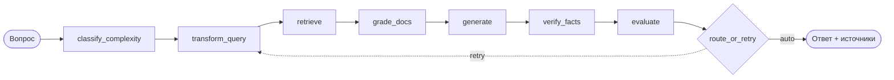

## Доказательства

<div class="q-cardgrid q-cardgrid--accent">
  <article class="q-card">
    <h3 class="q-title">
      <span class="q-label">Опубликованная документация</span>
    </h3>
    <div class="q-body"><p>Документация опубликована под <code>/RAG_Support_Assistant</code>. Английская и русская стартовые страницы поддерживаются явно.</p></div>
  </article>

  <article class="q-card">
    <h3 class="q-title">
      <span class="q-label">Засеянная демо-база</span>
    </h3>
    <div class="q-body"><p>Демо-база начинается с трёх документов: гарантия, возвраты и ошибки E10-E30. E20 описан в <code>errors_e10_e30.md</code>.</p></div>
  </article>

  <article class="q-card">
    <h3 class="q-title">
      <span class="q-label">Оценка по фикстуре</span>
    </h3>
    <div class="q-body"><p>Набор содержит 12 кейсов по шести темам: коды ошибок, сброс пароля, гарантия, установка, биллинг и общие вопросы. Демо-база из трёх документов покрывает не все темы фикстуры.</p></div>
  </article>

  <article class="q-card">
    <h3 class="q-title">
      <span class="q-label">Прослеживаемая API-поверхность</span>
    </h3>
    <div class="q-body"><p>Каталог API строится из декораторов маршрутов FastAPI, а <code>/api/ask</code> возвращает ответ вместе с источниками и пронумерованными ссылками-цитатами.</p></div>
  </article>
</div>

### Путь одного вопроса через LangGraph



Полный flowchart со всеми 12 узлами и условными переходами автоматически
генерируется из `agent/graph.py` на странице
[LangGraph state machine](/RAG_Support_Assistant/ru/architecture/langgraph/).

### Что возвращает `/api/ask` на вопрос «Как исправить E20?»

```json
{
  "answer": "Ошибка E20 связана с проблемой слива воды. Возможные причины: засорённый сливной фильтр, перегиб сливного шланга или неисправность сливного насоса [1].",
  "sources": [
    { "source": "errors_e10_e30.md", "page_content": "E20 — проблема со сливом воды …" }
  ],
  "citations": [
    { "index": 1, "doc_id": "errors_e10_e30.md", "title": "errors_e10_e30.md", "excerpt": "клапан слива / фильтр …" }
  ]
}
```

Форма закреплена Pydantic-моделями `AskResponse`, `SourceInfo`, `Citation` в `api/routers/conversation.py`. Полный разбор узлов графа — на странице [Что делает ассистент](/RAG_Support_Assistant/ru/examples/).

## Начать здесь

- [Что делает ассистент](/RAG_Support_Assistant/ru/examples/) — один вопрос E20 проходит через весь граф.
- [Воспроизвести E20](/RAG_Support_Assistant/ru/reproduce-e20/) — детерминированный путь доверия: засеять, загрузить, спросить, проверить.
- [Запустить локально](/RAG_Support_Assistant/ru/guides/quickstart/) — как поднять стек локально.
- [Оценка](/RAG_Support_Assistant/ru/evaluation/) — что измеряется, как, и где границы.
- [GitHub](https://github.com/brownjuly2003-code/RAG_Support_Assistant) — исходный код.
